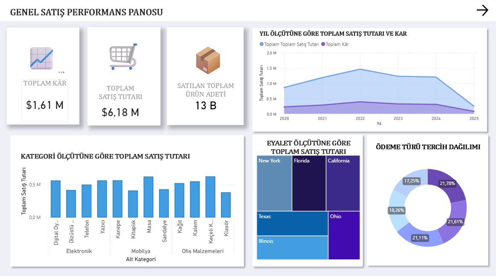
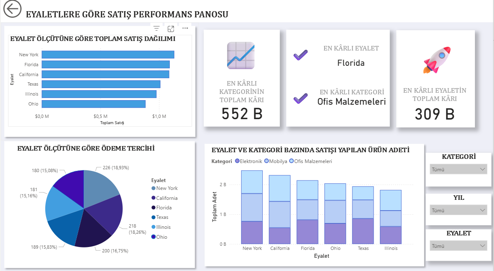
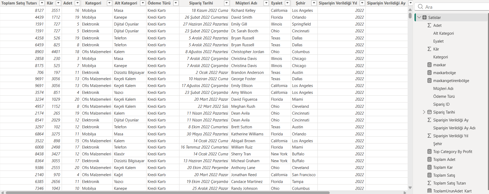

#  Satış Performans Analizi – Power BI Dashboard

Bu çalışma, Kaggle’dan elde edilen bir satış veri seti kullanılarak Power BI üzerinde hazırlanmış bir **satış performansı analiz projesidir**. Projede veri temizleme, veri modelleme ve görselleştirme adımları uygulanarak satış faaliyetlerine ilişkin kapsamlı bir dashboard oluşturulmuştur.

##  Projenin Amacı

Bu projenin temel amacı, satış süreçlerine yönelik kritik göstergeleri bütünsel bir bakış açısıyla incelemek ve karar vericilere veri temelli içgörüler sunmaktır. Hazırlanan dashboard, satış ve kârlılık eğilimlerini, kategori ve eyalet bazlı performansı ve müşteri ödeme davranışlarını analiz etmeyi amaçlamaktadır.

##  Veri Hazırlama ve Temizleme Süreci

Dashboard oluşturulmadan önce veri seti üzerinde aşağıdaki işlemler gerçekleştirilmiştir:

- Analiz için gerekli olmayan sütunlar veri setinden çıkarıldı.  
- Tarih ve benzeri alanlarda gerekli format düzenlemeleri yapıldı.  
- Eksik veya tutarsız veriler temizlendi.  
- Veri modeli Power BI içerisinde yeniden yapılandırıldı.

Bu adımlar sonucunda, analiz için güvenilir, düzenli ve tutarlı bir veri yapısı elde edilmiştir.

##  Genel Satış Performansı Dashboard’u

Bu panelde, işletmenin satış performansını genel hatlarıyla sunan temel metrikler yer almaktadır:

- **Toplam Satış Tutarı**  
- **Toplam Kâr**  
- **Satılan Toplam Ürün Adedi**  
- **Yıllara Göre Satış Tutarı ve Kâr**  
- **Kategori Bazlı Toplam Satış**  
- **Eyalet Bazlı Toplam Satış**  
- **Ödeme Türü Dağılımı**

Bu görseller, işletmenin makro düzeydeki satış eğilimlerini hızlı ve anlaşılır bir biçimde yorumlamayı sağlar.

##  Eyalet Bazlı Satış Performansı Dashboard’u

Bu ikinci panel, eyalet bazındaki satış performansını daha detaylı bir şekilde analiz etmektedir. Panelde şu metrikler görselleştirilmiştir:

- **Eyaletlere Göre Toplam Satış Dağılımı**  
- **En Kârlı Kategori**  
- **En Kârlı Eyalet**  
- **En Kârlı Kategorinin Toplam Kârı**  
- **En Kârlı Eyaletin Toplam Kârı**  
- **Ödeme Türlerinin Eyalet Bazında Dağılımı**  
- **Eyalet × Kategori Bazında Satış Adetleri**

Bu panelde Kategori, Eyalet ve Yıl slicer'ları kullanılmıştır.Bu filtreler dashboard’u interaktif ve çok yönlü hale getirir; kullanıcılar istedikleri kombinasyonlarda analiz yapabilir.

##  Kullanılan Araçlar

- **Power BI Desktop**  
- **Excel** (Veri ön işleme için)  

## 📌 Sonuç

Bu Power BI projesi, satış performansına ilişkin önemli metrikleri yalın ve interaktif bir şekilde sunan kapsamlı bir analiz çalışmasıdır. Dashboard, satış trendlerinin izlenmesi, kârlılık analizleri ve bölgesel farklılıkların değerlendirilmesi açısından güçlü bir karar destek aracı niteliğindedir.

---
## Dashboard Görselleri

## Veri Seti Örnek Bölümü

